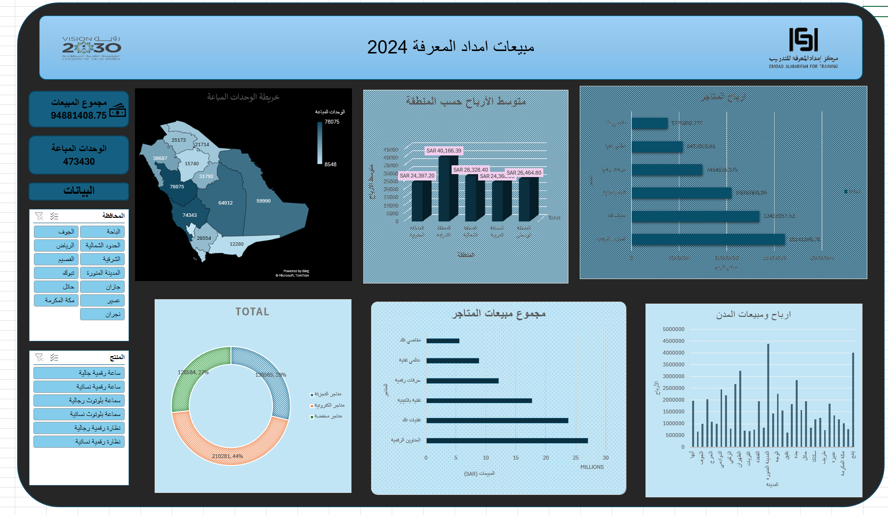

# 📊 لوحة تحليل مبيعات تجزئة تفاعلية | Retail Sales Analytics Dashboard
### Microsoft Excel — Advanced

> **ع:** لوحة معلومات تفاعلية متكاملة لتحليل أداء مبيعات قطاع التجزئة في المملكة العربية السعودية، بُنيت ضمن برنامج تدريبي متخصص في تحليل البيانات. تعرض البيانات جغرافياً وتحليلياً عبر مخططات متعددة ومقسمات تفاعلية.

> **EN:** A comprehensive interactive Excel dashboard analyzing retail sales performance across Saudi Arabia's regions. Built during a specialized data analytics training program, featuring geographic visualization, multi-dimensional charts, and dynamic slicers.

---

## 📸 لقطة اللوحة | Dashboard Preview

---

## 📌 أبرز المؤشرات | Key Metrics

| المؤشر | القيمة |
|--------|--------|
| إجمالي المبيعات | 94,881,408 ريال |
| إجمالي الوحدات المباعة | 473,430 وحدة |
| عدد المناطق المحللة | 13 منطقة |
| عدد السجلات | ~2,000 سجل مبيعات |
| أعلى متوسط أرباح منطقة | المنطقة الوسطى (40,166 ريال) |
| أنواع المتاجر | مخفضة · إلكترونية · أجهزة |

---

## 📊 مكونات اللوحة | Dashboard Components

| المكوّن | الوصف |
|---------|-------|
| 🗺️ خريطة الوحدات المباعة | توزيع جغرافي تفاعلي للمبيعات على مستوى المناطق |
| 📈 متوسط الأرباح حسب المنطقة | مقارنة أداء المناطق الجغرافية |
| 🏪 أرباح ومبيعات المتاجر | تصنيف أداء كل متجر بصرياً |
| 🍩 توزيع أنواع المتاجر | نسب مبيعات المتاجر المخفضة والإلكترونية وأجهزة |
| 🏙️ أرباح ومبيعات المدن | مقارنة الأداء على مستوى المدن |
| 🔽 مقسمات تفاعلية | فلترة حسب المحافظة والمنتج |

---

## 🛠️ المهارات المطبقة | Skills Applied

| ع | EN |
|---|-----|
| جداول محورية متقدمة | Advanced Pivot Tables |
| دالة GETPIVOTDATA | GETPIVOTDATA formula |
| دوال XLOOKUP و IF | XLOOKUP & IF functions |
| تصميم لوحة معلومات احترافية | Professional Dashboard Design |
| خريطة جغرافية تفاعلية | Interactive Map Visualization |
| مقسمات Slicers متعددة | Multi-field Slicers |
| تنظيف البيانات وتوحيدها | Data Cleaning & Standardization |
| تحليل الأرباح متعدد الأبعاد | Multi-dimensional Profit Analysis |

---

## 🛠️ الأدوات | Tools

---

## 📝 ملاحظة | Note

**ع:** بُنيت هذه اللوحة ضمن برنامج تدريبي متخصص في تحليل البيانات. البيانات المستخدمة بيانات تدريبية لمحاكاة بيئة مبيعات تجزئة واقعية. جميع مراحل التنظيف، النمذجة، وتصميم اللوحة تمت بشكل مستقل من قبل المؤلف.

**EN:** This dashboard was built during a specialized data analytics training program using training datasets simulating a real retail sales environment. All data cleaning, modeling, and dashboard design were performed independently by the author.

---

## 👤 المؤلف | Author

**أحمد الهزازي | Ahmed Alhazazi**
- 🔗 [LinkedIn](https://www.linkedin.com/in/ahmed-alhazazi/)
- 💻 [GitHub](https://github.com/Ahmed-hz)
- 📧 AlhazzaziAhmed@gmail.com
